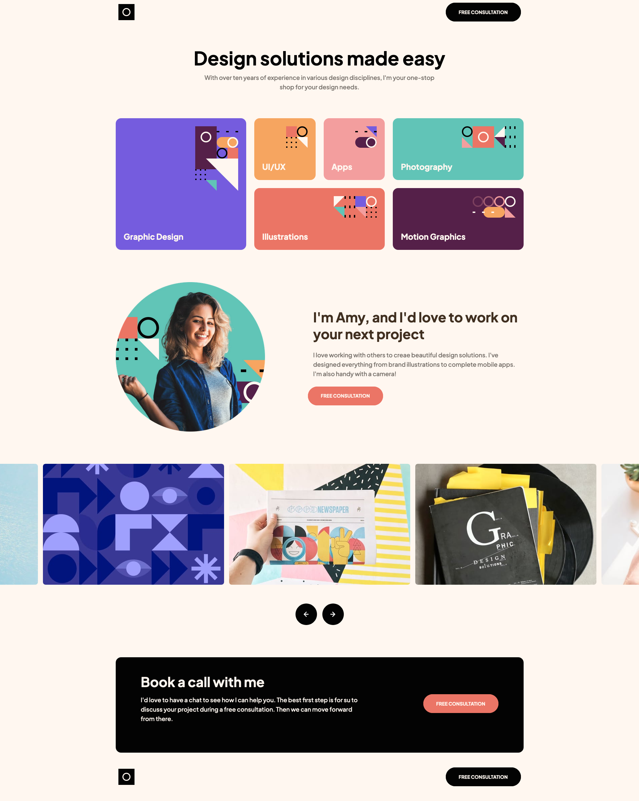

# Frontend Mentor - Single-page design portfolio solution

This is a solution to the [Single-page design portfolio challenge on Frontend Mentor](https://www.frontendmentor.io/challenges/singlepage-design-portfolio-2MMhyhfKVo).

## Table of contents

- [Frontend Mentor - Single-page design portfolio solution](#frontend-mentor---single-page-design-portfolio-solution)
  - [Table of contents](#table-of-contents)
  - [Overview](#overview)
    - [The challenge](#the-challenge)
    - [Screenshot](#screenshot)
    - [Links](#links)
  - [My process](#my-process)
    - [Built with](#built-with)
  - [Author](#author)

## Overview

### The challenge

Users should be able to:

- View the optimal layout for the site depending on their device's screen size
- See hover states for all interactive elements on the page
- Navigate the slider using either their mouse/trackpad or keyboard

### Screenshot

### Links

- [Live Site URL](https://jade-begonia-f6f8d9.netlify.app)

## My process

### Built with

- Semantic HTML5 markup
- Mobile-first workflow
- [Tailwindcss](https://tailwindcss.com/)
- [Daisyui](https://tailwindcss.com/)
- [SwiperJS](https://tailwindcss.com/)

## Author

- Frontend Mentor - [@samallen659](https://www.frontendmentor.io/profile/yourusername)
- Twitter - [@Sambo0110](https://www.twitter.com/Sambo0110)
